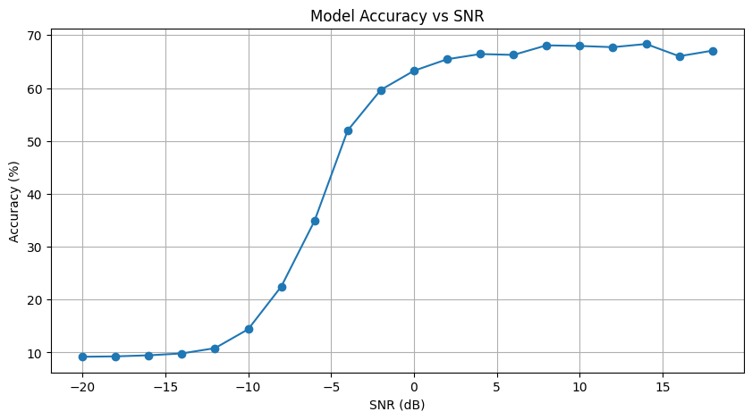
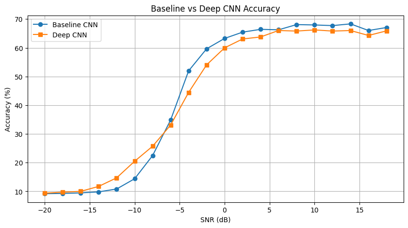
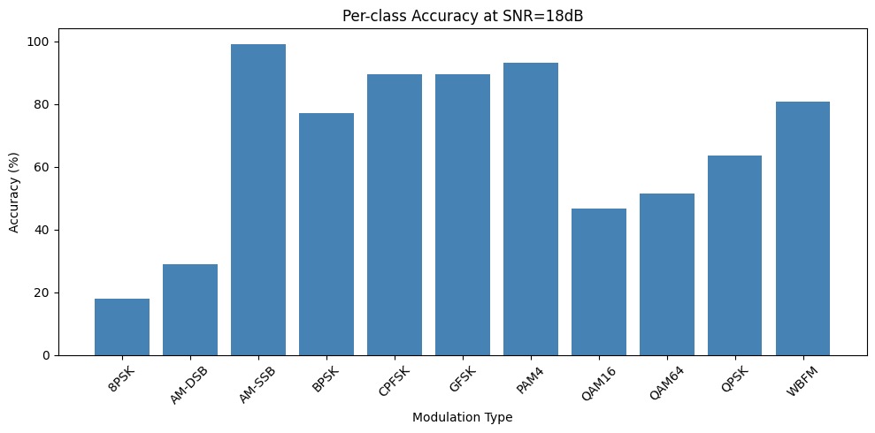
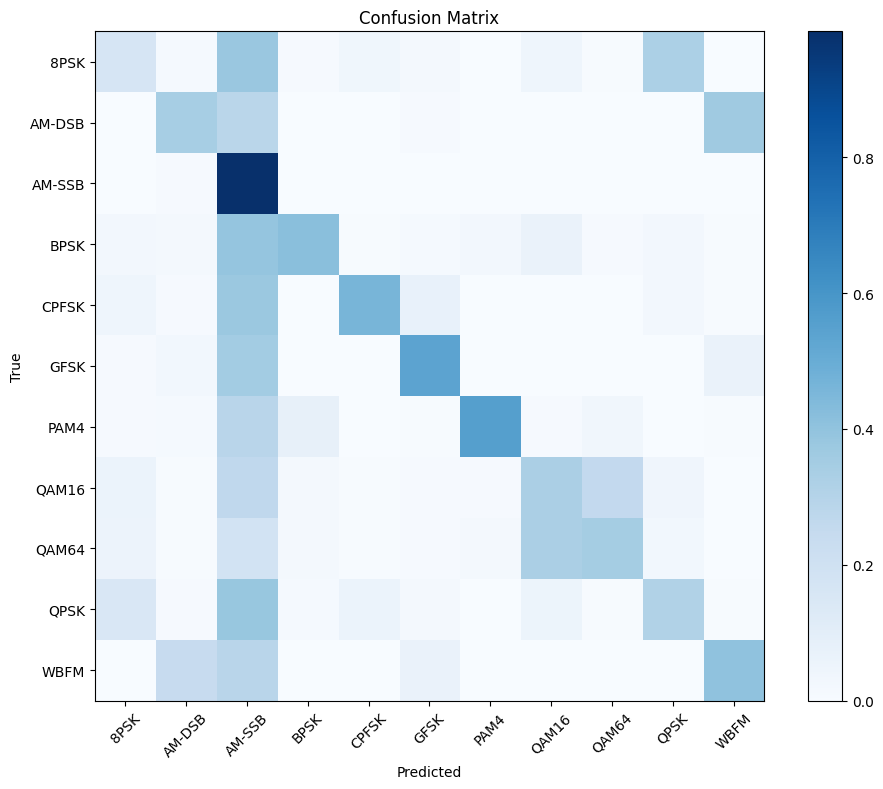

# RF Signal Classifier

A deep learning model that classifies radio signal modulations from IQ samples, trained on the [RadioML 2016.10A](https://www.deepsig.ai/datasets) dataset across varying SNR conditions.

Built as a personal project to bridge my background in embedded systems/DSP with machine learning.

---

## Problem

In real-world wireless communication systems, automatically identifying the modulation type of a received signal is a critical task — used in cognitive radio, spectrum monitoring, and signal intelligence.

The challenge: classification must work even at low Signal-to-Noise Ratio (SNR), where the signal is barely distinguishable from noise.

---

## Dataset

- **RadioML 2016.10A** — 220,000 IQ signal samples
- **11 modulation types:** 8PSK, AM-DSB, AM-SSB, BPSK, CPFSK, GFSK, PAM4, QAM16, QAM64, QPSK, WBFM
- **SNR range:** -20 dB to +18 dB
- Each sample: shape `(2, 128)` — I and Q channels over 128 time steps

---

## Model Architecture

A 1D CNN treating the IQ signal as a 2-channel time series:

- **Input:** `(batch, 2, 128)` — I and Q channels
- **2x Conv1D blocks** — extract local patterns across time steps
- **MaxPooling + Dropout** — downsample and prevent overfitting
- **Fully connected layers** — final classification into 11 classes

A deeper variant (4 Conv1D layers) was also trained for comparison.

---

## Results

### Accuracy vs SNR
The model learns nothing below -12dB (pure noise) but climbs rapidly from -10dB, 
plateauing around **68% at high SNR** — consistent with published benchmarks on this dataset.



### Baseline vs Deep CNN
A deeper 4-layer CNN was compared against the baseline. 
Both models converged to similar accuracy (~66-68%), suggesting the bottleneck 
is signal complexity at low SNR rather than model capacity.



### Per-class Accuracy at 18dB
At clean signal conditions, some modulations are classified near perfectly 
(AM-SSB: 100%, PAM4: 93%) while phase-based modulations (8PSK, QAM16, QAM64) 
remain harder to distinguish due to similar constellation shapes.



### Confusion Matrix
The model's errors are physically meaningful — it confuses modulations 
that genuinely look similar in IQ space (e.g. QPSK vs 8PSK vs QAM16).



---

## Key Insights

- Classification is near-random below -10dB — noise completely dominates the signal
- Model failures are physically meaningful: it confuses modulations with similar 
  constellation shapes (QPSK, 8PSK, QAM16) not random classes
- A deeper CNN did not outperform the baseline, suggesting the bottleneck is 
  signal complexity at low SNR rather than model capacity

---

## Quick Start

### Installation
```bash
git clone https://github.com/lilnassg/rf-signal-classifier
cd rf-signal-classifier
python -m venv venv
source venv/Scripts/activate  # Windows
pip install -r requirements.txt
```

### Download Dataset
Download [RadioML 2016.10A](https://www.kaggle.com/datasets/nolasthitnotomorrow/radioml2016-deepsigcom) and place the `.pkl` file in the `data/` folder.

### Run Inference
```bash
python src/predict.py
```

---

## Project Structure
```
rf-signal-classifier/
├── notebooks/
│   ├── 01_data_exploration.ipynb
│   ├── 02_preprocessing.ipynb
│   └── 03_model.ipynb
├── src/
│   └── predict.py
├── models/          # saved model weights
├── data/            # dataset (not tracked)
└── requirements.txt
```

---

## Tech Stack
Python • PyTorch • NumPy • Scikit-learn • Matplotlib

---

## Author
Nassib El Saghir — [LinkedIn](https://linkedin.com/in/nassib-el-saghir)